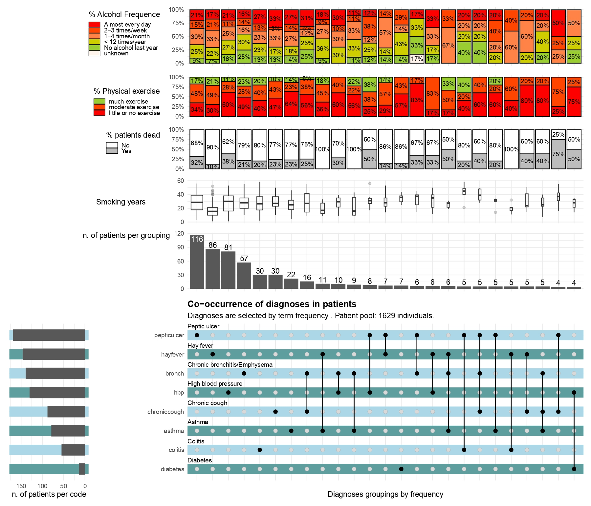

```{r setup, include=FALSE}
knitr::opts_chunk$set(echo = TRUE)
```

<style type="text/css">

body, td {
   font-size: 14pt;
}
code.r{
  font-size: 12px;
}
pre {
  font-size: 12px
}
</style>


## Problem statement
<div style="text-align: justify">
Contingency tables are in general used to evaluate or cross the simultaneous combination of many characteristics in data. While crossing two qualitative variables might be quite easy to visualize in tables, beyond three variables the task appears to be quite confusing. However in medical analyses, especially for diagnoses, it might be quite helpful to investigate in patients the co-occurrence of medical diagnoses in order to reveal clinical patterns and orientate the decision making. Upset plots turn out to be an ideal tool to visualize and investigate the combination of many diagnoses as well as symptoms in clinical patients. In the framework of this demonstration I will visualize the co-occurrence of diagnoses in patients as well as investigating some of the characteristics of the patients in each combination of diagnoses.

<b> INPUT: </b>  an open source patient dataset file in csv format <b> nhefs.csv </b> made available by the University of Havard

A code book of the variables in the dataset is also provided in the file entitled <b> NHEFS_Codebook.csv </b>

<b> OUTPUT: </b>  a PDF file, displaying the UpSet Plot of the combinations of most frequent diagnoses, annotated by other characteristics to show patterns

</div>

## Dataset description

<div style="text-align: justify">
For the purpose of this project, I will use the <b> nhefs dataset </b> which is a cleaned data set of the data used in Causal Inference by Hernán and Robins. nhefs is dataset containing data from the National Health and Nutrition Examination Survey Data I Epidemiologic Follow-up Study (NHEFS). The NHEFS was jointly initiated by the National Center for Health Statistics and the National Institute on Aging in collaboration with other agencies of the United States Public Health Service. A detailed description of the NHEFS, together with publicly available data sets and documentation, can be found at https://www.hsph.harvard.edu/miguel-hernan/causal-inference-book/

</div>

## Loading libraries and dataset


```{r, echo=TRUE, results='hide', message=FALSE, warning=FALSE}


####################################################
############## R options & libraries ###############
####################################################

options(stringsAsFactors=FALSE)


if(!require("ComplexUpset"))
{
    install_github("https://github.com/cran/ComplexUpset")
}


if(!require("naniar"))
{
    install_github("https://github.com/cran/naniar")
}

if(!require("ggplot2"))
{
    install_github("https://github.com/cran/ggplot2​")
}

if(!require("patchwork"))
{
    install_github("https://github.com/thomasp85/patchwork")
}

library(devtools)
## Loading required package: usethis
library(ComplexUpset)   # to make the Upset Plot
library(ggplot2)        # to decorate the Upset Plot
library(patchwork)      # to produce the final plot
library(lubridate)    # for date functions
library(dplyr)
library(naniar)


```


```{r Loading data}


file="nhefs.csv"
data=read.csv(file, colClasses="character")

# Displaying the names of the variables in the dataset
colnames(data)
```

## Data exploration and visualization of some characteristics


```{r }
head(data, n=2)
diseases <- c( "asthma", "bronch", "tb","hf","hbp", "pepticulcer","colitis","hepatitis","chroniccough","hayfever", "diabetes", "polio",  "tumor", "nervousbreak")

# since we are just interested in diseases, I subselect the corresponding variables with other additional features in a new data frame
subdata <- data[, c(diseases, "death", "smokeyrs", "sex","age", "alcoholfreq","education", "race", "exercise")]

# investigating the presence of missing data
colSums(is.na (subdata))
```


```{r  message=FALSE, warning=FALSE}
## Forcing conversion of some numerical variables loaded as strings

subdata[c(diseases,"smokeyrs","age")] <- lapply(subdata[c(diseases,"smokeyrs","age")],as.numeric)


gg_miss_var(subdata,show_pct = TRUE) 


par (mfrow=(c(2,2)))

## Age distribution in the dataset

ggplot(subdata, aes(x=age)) + 
  geom_histogram()+
  ylab("Number of patients")


ggplot(subdata, aes(x=sex, fill=sex)) + 
  geom_bar() +
  scale_fill_discrete(labels=c("Male", "Female"))+
  xlab("Gender")+
  ylab("Number of patients")


# 1: 8TH GRADE OR LESS, 2: HS DROPOUT, 3: HS, 4:COLLEGE DROPOUT, 5: COLLEGE OR MORE
ggplot(subdata, aes(x=education, fill=education)) + 
  geom_bar() +
  scale_fill_discrete(labels=c("8TH GRADE OR LESS", "HS DROPOUT", "HS", "COLLEGE DROPOUT","COLLEGE OR MORE"))+
  xlab("Education")+
  ylab("Number of patients")

ggplot(subdata, aes(x=death, fill=death)) + 
  geom_bar() +
  scale_fill_discrete(labels=c("No", "Yes")) +
  xlab("Death status")+
  ylab("Number of patients")
  
```

## Displaying the basis upset plot showing co-occurences of diseases in the dataset

```{r Upset plot,  message=FALSE, warning=FALSE}

##################### UpSet plot options ######################
###############################################################


# max number of codes to combine

num_code=8

# min number of patient within a code combination (obfuscation)

min_size=4

# max number of code combinations (do not modify)

num_comb=25

# min number of codes in the combinations  (do not modify)

min_degree=1

####################################################


###############################################################
############### Select codes on term frequency basis ##########
###############################################################

# subdata[c(diseases,"smokeyrs","age")] <- lapply(subdata[c(diseases,"smokeyrs","age")],as.numeric)

disease_table= as.data.frame(as.table(colSums(subdata[,diseases])))
disease_table=disease_table[order(disease_table$Freq,decreasing=TRUE),]

##  Adeline: eventually extend num_code
## select the 8 most frequent diseases
frequent_diseases=head(as.character(disease_table$Var1),num_code)


## convert diseases dummy variables to logical variables

subdata[diseases] <-subdata[diseases]==1     ## converse dummy variables for diseases to logical values

## Mapping diseases variables with real world names

mapping_diseases <- data.frame(var=c( "hbp","diabetes","pepticulcer","hayfever","bronch","chroniccough","asthma","colitis", "hf", "hepatitis"), real_names=c("High blood pressure", "Diabetes", "Peptic ulcer", "Hay fever", "Chronic bronchitis/Emphysema", "Chronic cough", "Asthma", "Colitis", "Heart failure", "Hepatitis"))


################ Essential upset plot


plottitle="Co-occurrence of diagnoses in patients"
plotsubtitle=paste("Diagnoses are selected by term frequency . Patient pool: ",nrow(subdata)," individuals.",sep="")


u=NULL


u=upset(
    data=subdata,
    intersect=frequent_diseases,
    name="Co-occurence diagnoses", 
    mode="exclusive_intersection",
    min_size = min_size,
    n_intersections=num_comb,
    keep_empty_groups=FALSE,
    min_degree=min_degree,
    height_ratio=c(0.8,0.2),
    set_size=FALSE,
    matrix=(
        intersection_matrix(
            geom=geom_point(shape='circle',size=2),
            segment=geom_segment(alpha=0.4)
        )
         + annotate(
            geom='text',
            color="black",
            label=mapping_diseases[match(frequent_diseases,mapping_diseases[,"var"]),"real_names"],
            x=-Inf,
            y=frequent_diseases,
            size=3,
            vjust=-1.5,
            hjust=0
        )+coord_cartesian(clip = "off")
    )
    ) +labs(title=plottitle,subtitle=plotsubtitle)+theme(plot.title=element_text(face="bold"))


d=length(unique(as.numeric(u$data$group)))

# get max y in the upset plot frequencies
temp=as.data.frame(table(u$patches[[1]][[1]]$data$exclusive_intersection))


my=max(temp[temp$Var1!="Outside of known sets",2])


#u

upset(
    data=subdata,
    intersect=frequent_diseases,
    name=paste("Diagnoses"," groupings by frequency",sep=""), 
    mode="exclusive_intersection",
    min_size = min_size,
    keep_empty_groups=FALSE,
    min_degree=min_degree,
    height_ratio=c(1,0.1),
    width_ratio=c(0.1,0.5),
    n_intersections=num_comb,   
    set_size=upset_set_size()+ ylab('n. of patients per code'),    
    encode_sets=FALSE,
    base_annotations=list(
        'Intersection size'=intersection_size(text_colors=c(on_background='black',on_bar='white'))
        + ylab('')
        + annotate("text",x=-Inf,y=my,label = "n. of patients per grouping", hjust=1.2)
        + coord_cartesian(clip = "off")
        ),
    stripes=upset_stripes(mapping = aes(),geom=geom_segment(size = 7),colors = c("cadetblue", "lightblue"),data = NULL),

    matrix=(
        intersection_matrix(
            geom=geom_point(shape='circle',size=2),
            segment=geom_segment(alpha=0.4)
        )+ annotate(
            geom='text',
            color="black",
            label=mapping_diseases[match(frequent_diseases,mapping_diseases[,"var"]),"real_names"],
            #label=frequent_diseases,
            x=-Inf,
            y=frequent_diseases,
            size=3,
            vjust=-1.5,
            hjust=0
        )+coord_cartesian(clip = "off")))

```


### Comment

<div style="text-align: justify">
We can see from this plot that most of the patients are suffering only from one of these diseases in decreasing order: peptic ulcer, hay fever, High blood pressure, Chronic bronchitis/Emphysema. In general simultaneous occurrence of diseases seem to be: chronic bronchitis and chronic cough; Hay fever and asthma; chronic bronchitis and high blood pressure; chronic bronchitis and asthma. In our dataset, some patients are also suffering from three diseases simultaneously. These are: Hay fever, chronic bronchitis and asthma; Peptic ulcer, chronic bronchitis and chronic cough. Depending on the dataset content and structure, even more combinations of co-occurrence of diagnoses can be shown. This way a better quantified visualization of simultaneous co-occurrence of diagnoses his made possible and facilitates the general overview. Another interesting perspective would now to know the characteristics of those patients in terms for instance of gender, age, education, etc. This is done in the next section.

A pdf file of this plot has been made available in the folder under the name <b> upset_plot_base </b> for a better appreciation of the graph.

</div>

## Annotating the upset plot with other features to see patterns

```{r,  message=FALSE, warning=FALSE, out.width="800px", out.height="800px"}

alcohol_freq_values=c(
 # 0: Almost every day, 1: 2-3 times/week, 2: 1-4 times/month, 3: < 12 times/year, 4: No alcohol last year, 5: Unknown
"0" ="red",
"1"=    "orangered",
"2"=    "sienna1",
"3"=    "yellow3",
"4"=    "yellowgreen",
"5"=    "seashell"
)


exercise_freq_values=c(
 # 0:much exercise,1:moderate exercise,2:little or no exercise
"0"=    "yellowgreen",
"1"=    "orangered",
"2"=    "red"
    
)


# titles, captions


pdfname="co-occurrence of diagnoses in patients.pdf"


# Annotated upset plot

g=NULL

g=upset(
    data=subdata,
    intersect=frequent_diseases,
    name=paste("Diagnoses"," groupings by frequency",sep=""), 
    mode="exclusive_intersection",
    min_size = min_size,
    keep_empty_groups=FALSE,
    min_degree=min_degree,
    height_ratio=c(1,0.1),
    width_ratio=c(0.1,0.5),
    n_intersections=num_comb,   
    set_size=upset_set_size()+ ylab('n. of patients per code'),    
    encode_sets=FALSE,
    base_annotations=list(
        'Intersection size'=intersection_size(text_colors=c(on_background='black',on_bar='white'))
        + ylab('')
        + annotate("text",x=-Inf,y=my,label = "n. of patients per grouping", hjust=1.2)
        + coord_cartesian(clip = "off")
        ),
    stripes=upset_stripes(mapping = aes(),geom=geom_segment(size = 7),colors = c("cadetblue", "lightblue"),data = NULL),

    matrix=(
        intersection_matrix(
            geom=geom_point(shape='circle',size=2),
            segment=geom_segment(alpha=0.4)
        )
         + annotate(
            geom='text',
            color="black",
            label=mapping_diseases[match(frequent_diseases,mapping_diseases[,"var"]),"real_names"],
            x=-Inf,
            y=frequent_diseases,
            size=3,
            vjust=-1.5,
            hjust=0
        )+coord_cartesian(clip = "off")
    ),

    annotations = list(

    'Alcohol Frequence'=ggplot(mapping=aes(fill=alcoholfreq)) 
        + geom_bar(stat='count', position='fill',color="black")
        + scale_y_continuous(labels=scales::percent_format())
        + scale_fill_manual(labels = c("Almost every day", "2-3 times/week", "1-4 times/month", "< 12 times/year","No alcohol last year", "unknown"), values=alcohol_freq_values)
         + ylab('')
        + labs(fill='% Alcohol Frequence')
        + geom_text(
            aes(label=!!aes_percentage(relative_to='intersection')),            
            stat='count',
            size=3,
            position=position_fill(vjust = 0.5)
            )
    #geom_text(aes(label=ifelse(percent >= 0.07, paste0(sprintf("%.0f", percent*100),"%"),"")),
               # position=position_stack(vjust=0.5), colour="white")
        + theme(
            legend.position = c(-0.06, 1),
            legend.justification = c("right", "top"),
            legend.direction="vertical",
            legend.key.height=unit(0.1,"cm"),
            axis.title.y = element_text(angle = 0, vjust = 0.5)
             ),


'exercise'=ggplot(mapping=aes(fill=exercise))
        + geom_bar(stat='count', position='fill',color="black")
        + scale_y_continuous(labels=scales::percent_format())
        + scale_fill_manual( labels = c("much exercise","moderate exercise","little or no exercise"),values=exercise_freq_values)
        + ylab('')
        + labs(fill="% Physical exercise")
        + geom_text(
            aes(label=!!aes_percentage(relative_to='intersection')),
            stat='count',
            size=3,
                  position=position_fill(vjust = 0.5)
            )
        + theme(
            legend.position = c(-0.06, 0.8),
            legend.justification = c("right", "top"),
            legend.direction="vertical",
            legend.key.height=unit(0.1,"cm"),
            axis.title.y = element_text(angle = 0, vjust = 0.5)
             ),


    'patient dead'=ggplot(mapping=aes(fill=death))
        + geom_bar(stat='count', position='fill',color="black")
      #  +  scale_fill_discrete(name= '% patients dead', labels = c("No", "Yes"))
        + scale_y_continuous(labels=scales::percent_format())
        + scale_fill_manual(labels = c("No", "Yes"),values=c('white','grey'))
        + ylab('')
        + labs(fill='% patients dead')
        + geom_text(
            aes(label=!!aes_percentage(relative_to='intersection')),            
            stat='count',
            size=3,
                 position=position_fill(vjust = 0.5)
            )
        + theme(
            legend.position = c(-0.06, 1),
            legend.justification = c("right", "top"),
            legend.direction="vertical",
            legend.key.height=unit(0.1,"cm"),
            axis.title.y = element_text(angle = 0, vjust = 0.5)
             ),

'Smoking years'=ggplot(mapping=aes(y=smokeyrs))
        + geom_boxplot(#stat='count', position='fill',color="black"
          varwidth = TRUE, alpha=0.2 )
         + ylab('Smoking years')
          + theme(
            legend.position = "none",
            #plot.title = element_text(hjust = -0.3),
           # plot.margin = rep(grid::unit(0.75,"in"),4)
           axis.title.y = element_text(angle = 0, vjust = 0.5)
           )
        ) 
) +labs(title=plottitle,subtitle=plotsubtitle)+theme(plot.title=element_text(face="bold"))


```


```{r Configuring the displaying, message=FALSE, warning=FALSE, out.width="900px", out.height="800px"}


# relative proportions of the various parts of the plot

h=1
k=0.5
alcohol_h=1.5
exercise_h=1.1
dead_h=1.1
smoking_h=1.1
his_h=1.5
mat_x=0.5
# upper part including histogram...
s_plots=(alcohol_h+exercise_h+dead_h+smoking_h+his_h)*h
# combinations panel...
s_table=d*k
# ...altogether
plot_space=s_plots+s_table
# final plot
g=g+plot_layout(heights=c(h*alcohol_h,h*exercise_h,h*dead_h,h*smoking_h,h*his_h,k*d),ncol=2)

# Saving as a pdf file

# pdf("diagnoses_upset_plot.pdf",width=12,height=plot_space)

 #g
  dev.off()

```


```{r, fig.width=1, fig.height=10}

```

### Comment


<p> <b> <u>NB: </u> </b> </p>
This last visualization is made available on pdf and jpg file formats  in the folder under the name <b> diagnoses_upset_plot </b> for a better appreciation of the graph as a whole. 


<div style="text-align: justify">
Just as said above, an interesting step when displaying co-occurrence of diagnoses in a patient dataset is to see the patterns of those patients. Some of those features might be age, gender, education, race, smoking status, death status,etc, . In the plot above, I choose to display: frequency of drinking alcohol, frequency of practicing a physical exercise,  years of smoking and death status. So out of 1629 patients in our pool, 116 were suffering only from Peptic ulcer. And in this subset of patients suffering uniquely from peptic ulcer, they were smokers  for more than 20 years, more than 80% were no, little or moderate active in terms of physical exercise. Moreover 32% of them died. Similar comments can be drawn for patients diagnoses simultaneously of 2 or more diseases. For instance, of the 16 patients affected simultaneously of chronic cough and chronic bronchitis, 25% died, more than 90% are not really frequently practicing a physical exercise, over 30% drink alcohol almost every day.

</div>


